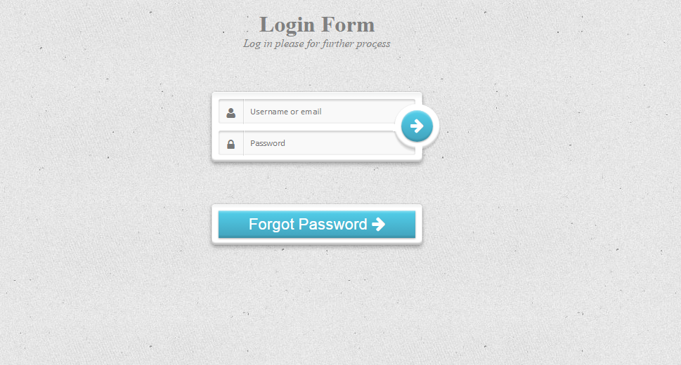
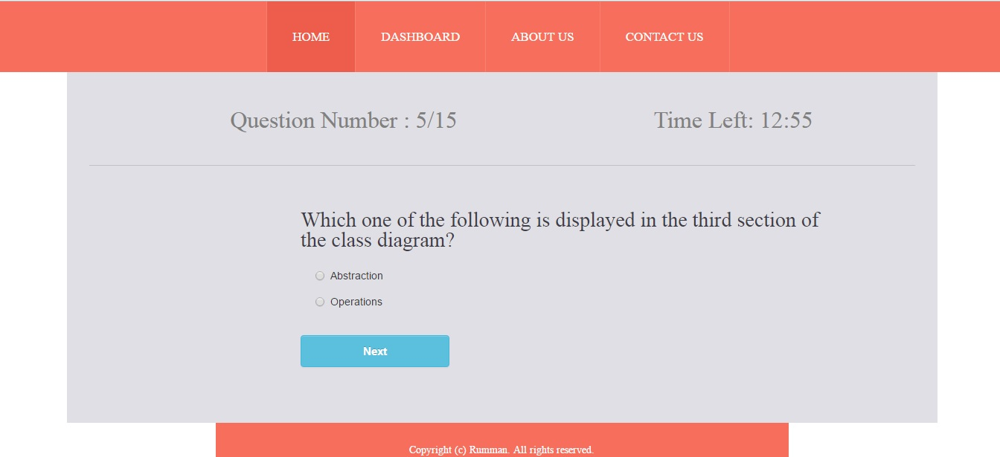
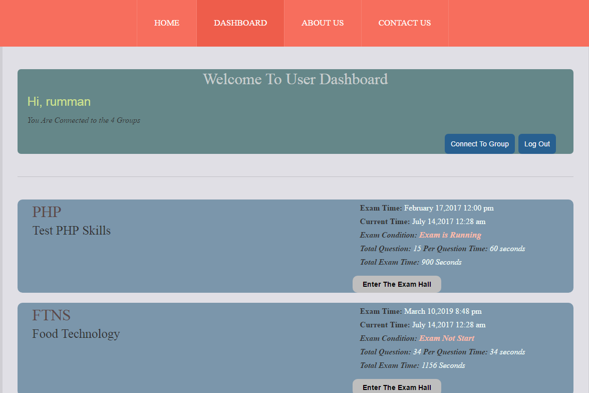
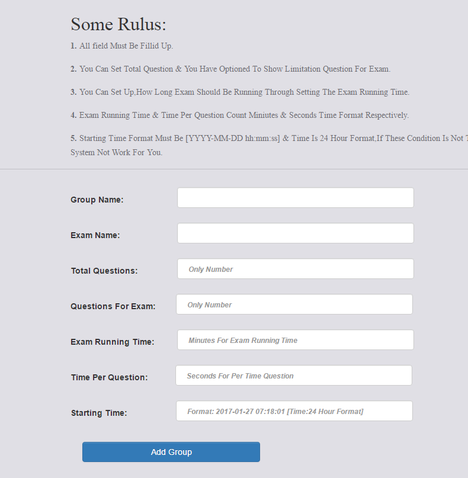
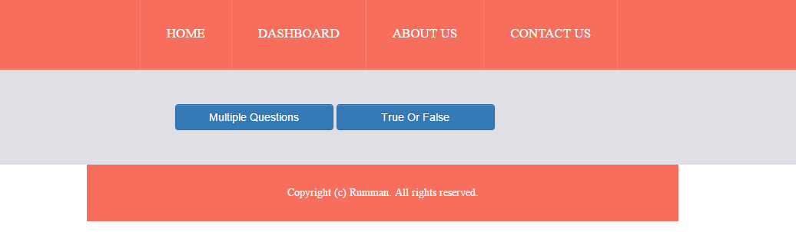
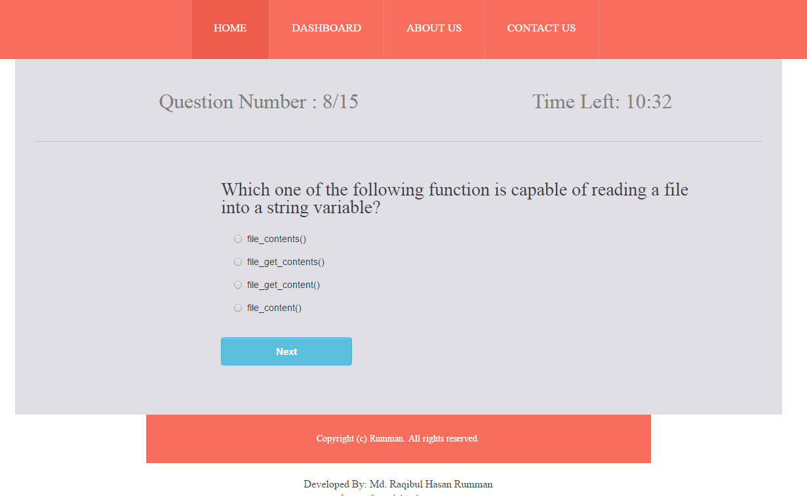
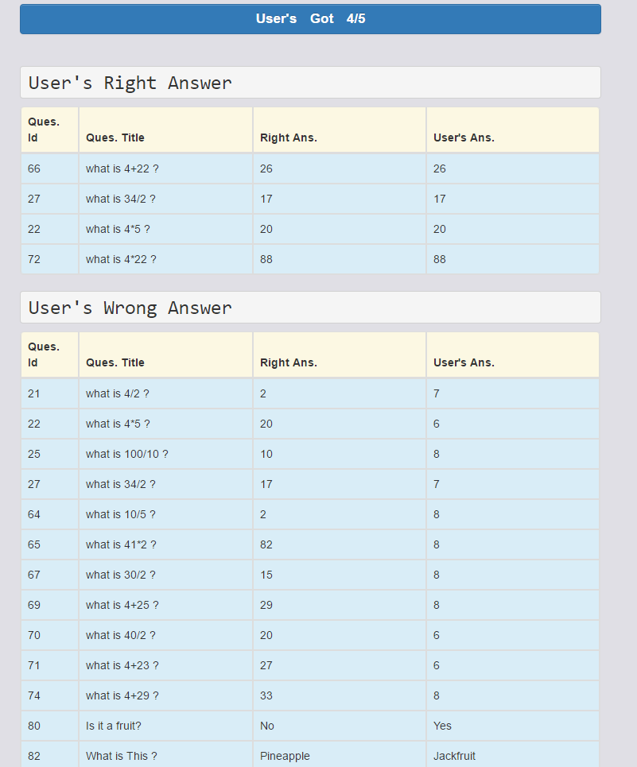

# Online Exam System 

This is an Online Exam System site built by PHP in OOP way. In this site,you can create or manage your exam & also participate any exam.

## Some Special Features:

1. Firstly, You can manage your exams both creation and participation.
2. This site is secured.
3. Using prepared statements for securiy & safe query to DB server.

## How This Site Works
 
### Who Takes The Exam(Administrators):

1. First you have to "Log In" from 'Administrators' tab.

2. If you don't have any id,first you have to "Registers" from "Administrators" tab & then 'Log In' from 'Administrators' tab.

3. When you sign in,you automatically get your registration id. It is also mentioned in the term of instructor id.

4. Then You have to create exam groups. Here you can set total questions, Questions you want to show,time per questions etc for the examinees.

5. Each Group has automatically a group token.

6. Then you have to set the questions. You can set 'MCQ' or 'True-False' questions.

7. Notice that,If you don't set the minimum questions,examinees will not able to participate the exam. Minimum questions means,questions you want to show the examinees. Suppose,you want to set the total questions 100 & want to show 25 questions for your examinees randomly. So,exams will not be start until you set the minimum 25 questions.

8. For User Connection you have to provide your 'registration id'(Instructor id) & Group token for set up the connection.

9. Users are connected each group only participate the exams.

10. You can see examinees details who are connected each group.

11. You can delete the users from any exam groups if you needed.

12. You can show the results in each user for each exam groups.

13. Users can't show the results until you published the exam groups results.

14. You can create & manage as many exam groups as you need.

###Who Participates The Exam(Examinees):

1. First you have to "Log In" from 'Test Takes' tab.

2. If you don't have any id,first you have to "Registers" from "Test Takers" tab & then 'Log In' from 'Test Takers' tab.

3. Then you have to connect the group to participate the exams.

4. To connect the group you need the group id & instructor id for that group.So,please contact you administrators to get the requirements.

5. After connected any group,you can see when exam will be started.You can participate any time between exam srart & end.

6. Once you start your exam,you can't participate twice. If you scroll back to home page after starting exam,your exam will be finished & can't longer be available for you.

7. After successfully finishing your exam,you have to wait to see the result until your admin published that result.

## Demo Purpose

**For Admin    => Username: rumman & Password: rumman57**
**For Examinee => Username: rumman & Password: rumman57**

 

 

 

 

 

 

 

 

 

 

Visit my website: [www.rh-rumman.me](http://www.rh-rumman.me)

#### That's All.Thanks.